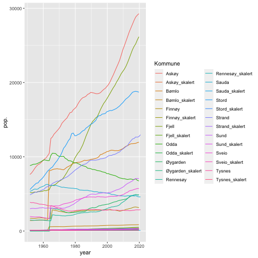

```r
library(ggplot)
```

```
## Error in library(ggplot): there is no package called 'ggplot'
```

```r
library(tidyverse)
```

```
## ── Attaching packages ──────────────────────────────────────────────── tidyverse 1.3.0 ──
```

```
## ✓ ggplot2 3.3.2     ✓ purrr   0.3.4
## ✓ tibble  3.0.3     ✓ dplyr   1.0.2
## ✓ tidyr   1.1.2     ✓ stringr 1.4.0
## ✓ readr   1.3.1     ✓ forcats 0.5.0
```

```
## ── Conflicts ─────────────────────────────────────────────────── tidyverse_conflicts() ──
## x dplyr::filter() masks stats::filter()
## x dplyr::lag()    masks stats::lag()
```

```r
library(readxl)
library(lubridate)
```

```
## 
## Attaching package: 'lubridate'
```

```
## The following objects are masked from 'package:base':
## 
##     date, intersect, setdiff, union
```

## Lese inn data og tranformere fra wide til long format


```r
x <- read_xlsx(path = "lokalkommuner.xlsx")
```

```
## New names:
## * `` -> ...1
```

```r
x
```

```
## # A tibble: 26 x 71
##    ...1  `1951` `1952` `1953` `1954` `1955` `1956` `1957` `1958` `1959` `1960`
##    <chr>  <dbl>  <dbl>  <dbl>  <dbl>  <dbl>  <dbl>  <dbl>  <dbl>  <dbl>  <dbl>
##  1 Sauda   5348   5425   5567   5660   5622   5662   5848   5927   6005   6110
##  2 Finn…   1718   1716   1703   1703   1726   1758   1761   1778   1752   1725
##  3 Renn…   1483   1458   1447   1444   1465   1460   1494   1468   1469   1438
##  4 Sveio   1954   1919   1908   1888   1897   1900   1906   1856   1818   1782
##  5 Bømlo   1407   1412   1419   1433   1446   1472   1466   1476   1479   1492
##  6 Stord   5583   5826   6036   6251   6442   6473   6771   6958   7176   7470
##  7 Odda    8807   8887   8983   8998   9038   9134   9241   9352   9499   9584
##  8 Sund    2998   3039   3052   3026   3038   3072   3119   3120   3152   3092
##  9 Fjell   5172   5154   5191   5259   5200   5335   5310   5341   5368   5453
## 10 Askøy   7616   7826   8117   8449   8726   8939   9041   9245   9472   9688
## # … with 16 more rows, and 60 more variables: `1961` <dbl>, `1962` <dbl>,
## #   `1963` <dbl>, `1964` <dbl>, `1965` <dbl>, `1966` <dbl>, `1967` <dbl>,
## #   `1968` <dbl>, `1969` <dbl>, `1970` <dbl>, `1971` <dbl>, `1972` <dbl>,
## #   `1973` <dbl>, `1974` <dbl>, `1975` <dbl>, `1976` <dbl>, `1977` <dbl>,
## #   `1978` <dbl>, `1979` <dbl>, `1980` <dbl>, `1981` <dbl>, `1982` <dbl>,
## #   `1983` <dbl>, `1984` <dbl>, `1985` <dbl>, `1986` <dbl>, `1987` <dbl>,
## #   `1988` <dbl>, `1989` <dbl>, `1990` <dbl>, `1991` <dbl>, `1992` <dbl>,
## #   `1993` <dbl>, `1994` <dbl>, `1995` <dbl>, `1996` <dbl>, `1997` <dbl>,
## #   `1998` <dbl>, `1999` <dbl>, `2000` <dbl>, `2001` <dbl>, `2002` <dbl>,
## #   `2003` <dbl>, `2004` <dbl>, `2005` <dbl>, `2006` <dbl>, `2007` <dbl>,
## #   `2008` <dbl>, `2009` <dbl>, `2010` <dbl>, `2011` <dbl>, `2012` <dbl>,
## #   `2013` <dbl>, `2014` <dbl>, `2015` <dbl>, `2016` <dbl>, `2017` <dbl>,
## #   `2018` <dbl>, `2019` <dbl>, `2020` <dbl>
```

```r
x_l <- pivot_longer(x, cols = `1951`:`2020`, names_to = "year", values_to = "pop.")
x_l
```

```
## # A tibble: 1,820 x 3
##    ...1  year   pop.
##    <chr> <chr> <dbl>
##  1 Sauda 1951   5348
##  2 Sauda 1952   5425
##  3 Sauda 1953   5567
##  4 Sauda 1954   5660
##  5 Sauda 1955   5622
##  6 Sauda 1956   5662
##  7 Sauda 1957   5848
##  8 Sauda 1958   5927
##  9 Sauda 1959   6005
## 10 Sauda 1960   6110
## # … with 1,810 more rows
```

```r
names(x_l)[1] <- "Kommune"
#make year a date
x_l$year <- as.Date(x_l$year, format = "%Y")
is.na(x_l) <- 0
```

## Plote dataene


```r
ggplot(data = x_l) +
  geom_line(mapping = aes(x = year, y = pop., color = Kommune))
```

```
## Warning: Removed 22 row(s) containing missing values (geom_path).
```



