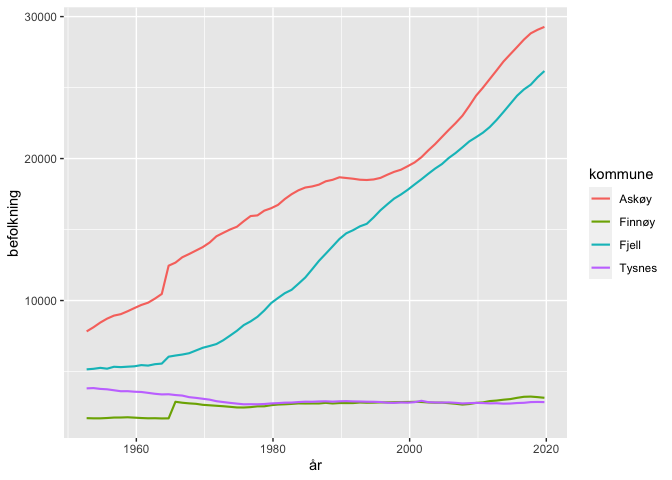
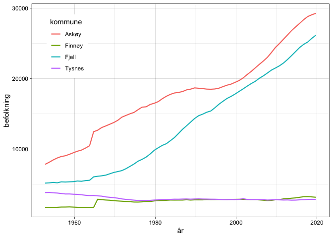

R Notebook
================

``` r
library(tidyverse)
```

    ## ── Attaching packages ───────────────────────────────────────────────────────────── tidyverse 1.3.0 ──

    ## ✓ ggplot2 3.3.2     ✓ purrr   0.3.4
    ## ✓ tibble  3.0.3     ✓ dplyr   1.0.2
    ## ✓ tidyr   1.1.2     ✓ stringr 1.4.0
    ## ✓ readr   1.3.1     ✓ forcats 0.5.0

    ## ── Conflicts ──────────────────────────────────────────────────────────────── tidyverse_conflicts() ──
    ## x dplyr::filter() masks stats::filter()
    ## x dplyr::lag()    masks stats::lag()

``` r
library(readxl)
```

## Lese inn data og tranformere fra wide til long format

``` r
# antar at "lokalkommuner.xlsx" er i working directory
x <- read_xlsx(path = "lokalkommuner.xlsx")
```

    ## New names:
    ## * `` -> ...1

``` r
# ser på 5 første linjer
head(x, n = 5)
```

    ## # A tibble: 5 x 71
    ##   ...1  `1951` `1952` `1953` `1954` `1955` `1956` `1957` `1958` `1959` `1960`
    ##   <chr>  <dbl>  <dbl>  <dbl>  <dbl>  <dbl>  <dbl>  <dbl>  <dbl>  <dbl>  <dbl>
    ## 1 Sauda   5348   5425   5567   5660   5622   5662   5848   5927   6005   6110
    ## 2 Finn…   1718   1716   1703   1703   1726   1758   1761   1778   1752   1725
    ## 3 Renn…   1483   1458   1447   1444   1465   1460   1494   1468   1469   1438
    ## 4 Sveio   1954   1919   1908   1888   1897   1900   1906   1856   1818   1782
    ## 5 Bømlo   1407   1412   1419   1433   1446   1472   1466   1476   1479   1492
    ## # … with 60 more variables: `1961` <dbl>, `1962` <dbl>, `1963` <dbl>,
    ## #   `1964` <dbl>, `1965` <dbl>, `1966` <dbl>, `1967` <dbl>, `1968` <dbl>,
    ## #   `1969` <dbl>, `1970` <dbl>, `1971` <dbl>, `1972` <dbl>, `1973` <dbl>,
    ## #   `1974` <dbl>, `1975` <dbl>, `1976` <dbl>, `1977` <dbl>, `1978` <dbl>,
    ## #   `1979` <dbl>, `1980` <dbl>, `1981` <dbl>, `1982` <dbl>, `1983` <dbl>,
    ## #   `1984` <dbl>, `1985` <dbl>, `1986` <dbl>, `1987` <dbl>, `1988` <dbl>,
    ## #   `1989` <dbl>, `1990` <dbl>, `1991` <dbl>, `1992` <dbl>, `1993` <dbl>,
    ## #   `1994` <dbl>, `1995` <dbl>, `1996` <dbl>, `1997` <dbl>, `1998` <dbl>,
    ## #   `1999` <dbl>, `2000` <dbl>, `2001` <dbl>, `2002` <dbl>, `2003` <dbl>,
    ## #   `2004` <dbl>, `2005` <dbl>, `2006` <dbl>, `2007` <dbl>, `2008` <dbl>,
    ## #   `2009` <dbl>, `2010` <dbl>, `2011` <dbl>, `2012` <dbl>, `2013` <dbl>,
    ## #   `2014` <dbl>, `2015` <dbl>, `2016` <dbl>, `2017` <dbl>, `2018` <dbl>,
    ## #   `2019` <dbl>, `2020` <dbl>

``` r
# går fra wide til long
x_l <- pivot_longer(x, cols = `1951`:`2020`, names_to = "year", values_to = "pop")
# pop as integer, year as date
x_l$pop. <- as.integer(x_l$pop)
x_l$year <- as.Date(x_l$year, format = "%Y")
# set name first variable
names(x_l)[1] <- "kommune"
#  set missing to 0
x_l[is.na(x_l)] <- 0
# Lager indikatorvariabel for skalert
x_l$skalert <- str_detect(x_l$kommune, "_skalert")
head(x_l, n = 5)
```

    ## # A tibble: 5 x 5
    ##   kommune year         pop  pop. skalert
    ##   <chr>   <date>     <dbl> <int> <lgl>  
    ## 1 Sauda   1951-09-22  5348  5348 FALSE  
    ## 2 Sauda   1952-09-22  5425  5425 FALSE  
    ## 3 Sauda   1953-09-22  5567  5567 FALSE  
    ## 4 Sauda   1954-09-22  5660  5660 FALSE  
    ## 5 Sauda   1955-09-22  5622  5622 FALSE

``` r
head(x_l)
```

    ## # A tibble: 6 x 5
    ##   kommune year         pop  pop. skalert
    ##   <chr>   <date>     <dbl> <int> <lgl>  
    ## 1 Sauda   1951-09-22  5348  5348 FALSE  
    ## 2 Sauda   1952-09-22  5425  5425 FALSE  
    ## 3 Sauda   1953-09-22  5567  5567 FALSE  
    ## 4 Sauda   1954-09-22  5660  5660 FALSE  
    ## 5 Sauda   1955-09-22  5622  5622 FALSE  
    ## 6 Sauda   1956-09-22  5662  5662 FALSE

``` r
filter(x_l, year < "1953-09-22" & year > "1950-09-22" )
```

    ## # A tibble: 52 x 5
    ##    kommune  year         pop  pop. skalert
    ##    <chr>    <date>     <dbl> <int> <lgl>  
    ##  1 Sauda    1951-09-22  5348  5348 FALSE  
    ##  2 Sauda    1952-09-22  5425  5425 FALSE  
    ##  3 Finnøy   1951-09-22  1718  1718 FALSE  
    ##  4 Finnøy   1952-09-22  1716  1716 FALSE  
    ##  5 Rennesøy 1951-09-22  1483  1483 FALSE  
    ##  6 Rennesøy 1952-09-22  1458  1458 FALSE  
    ##  7 Sveio    1951-09-22  1954  1954 FALSE  
    ##  8 Sveio    1952-09-22  1919  1919 FALSE  
    ##  9 Bømlo    1951-09-22  1407  1407 FALSE  
    ## 10 Bømlo    1952-09-22  1412  1412 FALSE  
    ## # … with 42 more rows

## Plot av dataene

### Ikke skalert

``` r
ggplot(data = filter(x_l, year < "2020-09-22"), mapping = aes(x = year, y = pop, group = kommune)) +
  geom_point(mapping = aes(colour = kommune), size = 1.5) +
  geom_line(colour = "Gray80")
```

<!-- --> \#\#\#
Skalert

``` r
ggplot(data = filter(x_l, year < "2020-09-22"), mapping = aes(x = year, y = pop, group = kommune)) +
  geom_point(mapping = aes(colour = kommune), size = 1.5) +
  geom_line(colour = "Gray80")
```

<!-- --> \#\#\# Alle

``` r
ggplot(data = filter(x_l, year < "2020-09-22"), mapping = aes(x = year, y = pop, group = kommune)) +
  geom_line(mapping = aes(colour = kommune), size = 1.25)
```

<!-- --> \#\#\# Utvalg

#### Make subset

``` r
x_l_s <- x_l %>%
  filter(year < "2020-09-22") %>%
  filter(year >= "1951-09-22") %>%
  filter(kommune %in% c("Askøy", "Fjell", "Finnøy", "Tysnes"))
```

``` r
g1 <- ggplot(data = filter(x_l_s, year < "2020-09-22" & year > "1951-09-22"), mapping = aes(x = year, y = pop, group = kommune)) +
  geom_line(mapping = aes(colour = kommune), size = 0.75)
g1
```

<!-- -->

``` r
themed <- g1 +
  theme(
    legend.justification = c(0, 1),
    legend.position = c(0, 1)
  )
themed
```

<!-- -->

``` r
g1_bw <- g1 +
    theme_linedraw() +
    theme(
    legend.justification = c(0, 1),
    legend.position = c(0.05, 0.95)
  ) 

g1_bw
```

<!-- -->
